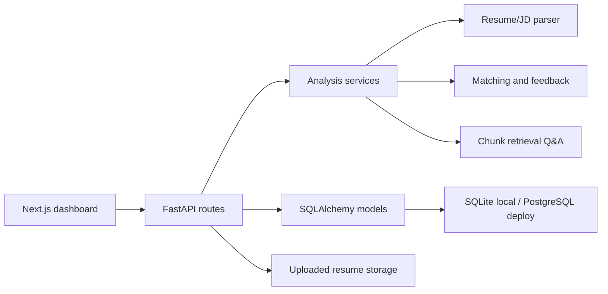

# AI Recruiter / Interview Assistant Platform

Full-stack AI application for resume-to-job-description screening, grounded profile Q&A, mock interview planning, and candidate feedback reports.

This project upgrades the earlier Streamlit prototype into the flagship product described in `AI_Application_Engineer_Career_PRD.docx`: a production-shaped FastAPI + Next.js app with persistent sessions, cited evidence, exportable reports, and a deployment-ready structure.

The older Streamlit and agent files remain in the repository for learning history, but the product entry points are the FastAPI backend and Next.js frontend documented below.

## Features

| PRD item | Implemented flow |
| --- | --- |
| FR1 Authentication and dashboard | Demo login endpoint and session dashboard |
| FR2 Resume upload and parsing | PDF/TXT upload with structured resume extraction |
| FR3 Job description upload | JD parsing into title, skills, responsibilities, and seniority |
| FR4 Candidate-job match score | Evidence-based score, matched skills, missing skills, explanation |
| FR5 RAG profile Q&A | Token retrieval over resume/JD chunks plus session-aware answers for score, gaps, and bullet rewrites |
| FR6 Mock interview generation | Technical, project, behavioral, and AI application questions |
| FR7 Feedback report | Strengths, gaps, next steps, and role-fit summary |
| FR8 History and export | Saved sessions, Markdown report export, and privacy delete |

Additional recruiter-facing enhancements:

- Component score breakdown for must-have skills, preferred skills, responsibility evidence, and seniority alignment.
- Analysis confidence and coverage percentages.
- Risk flags for missing must-have evidence, weak responsibility coverage, thin project proof, and contact-proof gaps.
- Tailored resume bullets, outreach message, and short learning plan for closing gaps.
- Quick Q&A prompts for score, gaps, and resume bullet rewrites.
- Workspace metrics, pipeline stages, reviewer notes, and decision memos so recruiters can manage candidates after analysis.
- Candidate priority score, ranked top-candidate panel, search, stage filter, and sort controls for active pipelines.
- Session activity timeline for analysis creation, workflow updates, and report exports.
- Recruiter action queue with computed next actions, urgency, and reasons for every active session.
- Interview-readiness score, screening checklist, and quality watchlist for evidence-based review gates.

## Architecture



## Tech Stack

- Frontend: Next.js, React, Tailwind CSS, lucide-react
- Backend: FastAPI, Pydantic, SQLAlchemy
- Database: SQLite locally, PostgreSQL via `DATABASE_URL` for Supabase/Neon/Render
- Parsing: `pdfminer.six`
- AI layer: deterministic local analysis by default, with `AI_PROVIDER` reserved for provider adapters

## Local Setup

Create and activate a virtual environment, then install the backend dependencies:

```powershell
python -m venv venv
.\venv\Scripts\Activate.ps1
python -m pip install -r requirements.txt
```

Create local environment values:

```powershell
Copy-Item .env.example .env
```

Start the API:

```powershell
uvicorn backend.main:app --reload --host 127.0.0.1 --port 8010
```

Install and start the frontend:

```powershell
cd frontend
pnpm install
pnpm dev
```

Open `http://localhost:3000`.

## API Routes

| Method | Route | Purpose |
| --- | --- | --- |
| `GET` | `/api/health` | Backend health and provider status |
| `POST` | `/api/auth/demo-login` | Creates or returns the demo user |
| `GET` | `/api/dashboard` | Workspace metrics, pipeline counts, product health, and repeated gaps |
| `GET` | `/api/sessions` | Lists saved analyses |
| `POST` | `/api/sessions/analyze` | Uploads resume and JD, returns analysis |
| `GET` | `/api/sessions/{id}` | Fetches one saved analysis |
| `GET` | `/api/sessions/{id}/activity` | Fetches the session audit timeline |
| `PATCH` | `/api/sessions/{id}/workflow` | Updates pipeline stage and reviewer notes |
| `POST` | `/api/sessions/{id}/ask` | Answers a profile/JD question with citations |
| `GET` | `/api/sessions/{id}/export` | Downloads a Markdown report |
| `DELETE` | `/api/sessions/{id}` | Deletes session metadata and uploaded resume |

## Environment Variables

```env
DATABASE_URL=sqlite:///./backend/data/app.sqlite3
UPLOAD_DIR=./uploads/analysis
CORS_ORIGINS=http://localhost:3000,http://127.0.0.1:3000
DEMO_USER_EMAIL=demo@ai-recruiter.local
DEMO_USER_NAME=Demo Recruiter
AI_PROVIDER=deterministic
NEXT_PUBLIC_API_BASE=http://127.0.0.1:8010
OLLAMA_BASE_URL=http://localhost:11434
```

For deployment, set `DATABASE_URL` to a PostgreSQL URL from Supabase, Neon, Railway, or Render. The reference PostgreSQL schema is in `backend/schema.postgres.sql`.

## Testing

```powershell
pytest
```

The current tests cover parsing, matching, interview generation, feedback generation, cited Q&A, dashboard metrics, workflow state, audit events, action queue, readiness checks, and export output.

## Privacy Notes

Uploaded resumes are stored under `UPLOAD_DIR` for session history. Use the delete action or `DELETE /api/sessions/{id}` to remove both the database session and stored resume file. Secrets belong only in environment variables and must not be committed.

## Roadmap

- Add production auth with Supabase Auth, Clerk, or Auth.js.
- Add background jobs for large resumes and long LLM calls.
- Add provider adapters for OpenAI, Gemini, and Ollama with deterministic fallback.
- Add retrieval evaluation cases and a small benchmark report.
- Deploy frontend on Vercel and backend on Render/Railway/Fly with PostgreSQL.

<!-- recruiter-review:start -->
## Review Status

Reviewed for recruiter visibility, setup clarity, and AI/ML positioning on June 13, 2026.
<!-- recruiter-review:end -->

<!-- repository-refresh: 2026-06-29 | preserved-order-rank: 005/71 -->
